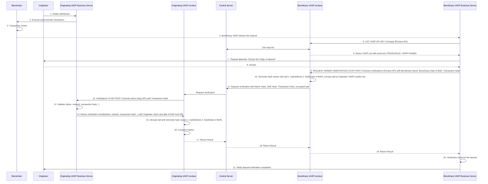

```mermaid
sequenceDiagram
		participant G as Blockchain
    participant A as Originator
    participant B as Originating VASP Business Server
    participant H as Originating VASP enclave
    participant C as Central Server
    participant D as Beneficiary VASP enclave
    participant E as Beneficiary VASP Business Server
    

    A->>B: 1. Initiate withdrawal
    B->>G: 2. Execute asset transfer transaction
    G->>G: 3. Transaction mined
    G-->>E: 4. Beneficiary VASP detects the Deposit

    E->>D: 5. LIST VASP API GET /v2/vasps (Enclave API)
    D<<->>C: Get vasp list
    D-->>E: 6. Return VASP List with protocols (TRAVELRULE, VERIFYNAME)
    E->>A: 7. "Deposit detected. Choose the Origin of deposit."
    A-->>E: 8. Answer
    E->>D: 9. REQUEST OWNER VERIFICATION V2 API POST /v2/owner-verifications (Enclave API) with Beneficiary Name, Beneficiary Date of Birth, Transaction Hash
		D->>D: 10. Generate hash values with salt 1. hash(Name) 2. hash(Date of Birth), encrypt salt by Originator VASP's public key
		D->>C: 11. Request verification with Name Hash, DoB Hash, Transaction Hash, encrypted salt
		C->>H: Request verification
		H->>B: 12. VerifyName V2 API POST /v2/verify-name (Vasp API) with Transaction Hash
		B->>B: 13. Validate (ticker, network, transaction hash...)
		B->>H: 14. Return verification results(ticker, network, transaction hash...) with Originator name and date of birth from DB
		H->>H: 15. Decrypt salt and Generate hash values 1. hash(Name) 2. hash(Date of Birth)
		H->>H: 16. Compare hashes
		H-->>C: 17. Return Result
		C-->>D: 18. Return Result
		D-->>E: 19. Return Result
		E->>E: 20. Verification done for the deposit
		E->>A: 21. Notify deposit verification completed
```